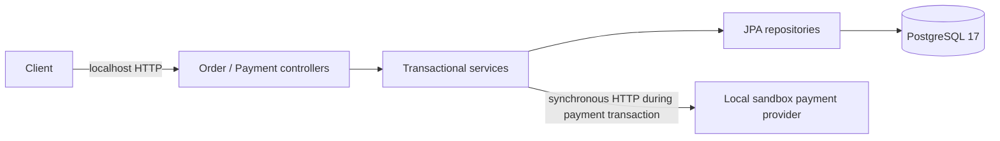

# Architecture — baseline

- Java 21, Spring Boot 3.5.16, Maven; package `dev.javiercano.backendrescue`.
- `order`: order aggregate, DTOs, repository, service and controller.
- `payment`: payment records, DTOs, repository, service and controller.
- `provider`: RestClient integration and a local simulator; no real money moves.
- `config`: intentionally permissive Spring Security policy.
- Database: `purchase_orders` → one-to-many `payments`; UUID identifiers and decimal amounts. Currency/refunds/cancellation APIs are outside this baseline.
- `open-in-view=false`: response mapping happens inside service transactions. Lazy payment collection access still causes N+1 on a list.
- The local simulator lives in the same server but is called through an actual HTTP connection. Tests replace its URL with a separate HTTP fixture on a random local port.
- Business endpoints and database bind to loopback by default. The permissive application security is still an intentional flaw; localhost containment is not a production security model.

There are no queues, cloud services, authentication server, frontend, AI API, paid dependencies or external payment credentials.

Spring Boot compatibility was checked against its [official system requirements](https://docs.spring.io/spring-boot/3.5/system-requirements.html) and the 3.5.16 artifact was verified in Maven Central. Versions are pinned in `pom.xml`; PostgreSQL Compose follows the 17 major line.
